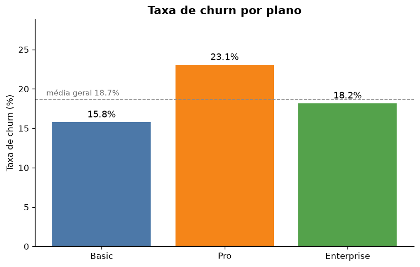
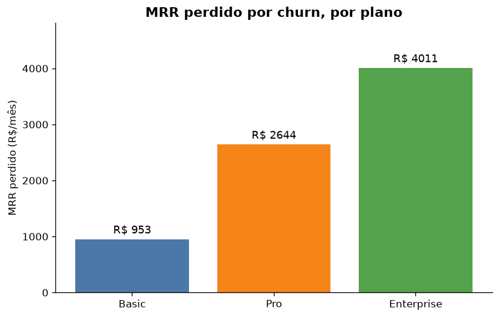

# Análise de Churn de Clientes

Análise exploratória de churn (cancelamento) de uma base de clientes SaaS,
com foco em responder uma pergunta de negócio: **onde a empresa mais perde
clientes e, principalmente, onde mais perde receita?**

O projeto vai da ingestão e limpeza dos dados até insights acionáveis e
recomendações, usando Python + Pandas para a análise e Matplotlib para a
visualização.

## Principais resultados

- **Churn geral de 18,7%** — quase 1 em cada 5 clientes cancela.
- **O plano Pro tem a maior _taxa_ de churn (23,1%)** — problema de retenção
  em volume.
- **O plano Enterprise concentra a maior _perda de receita_** (~R$ 4 mil/mês,
  ~53% de todo o MRR perdido), mesmo tendo poucos cancelamentos.
- **Insight central: taxa de churn ≠ impacto financeiro.** Priorizar só pela
  taxa levaria a ignorar onde mais se perde dinheiro.

| Plano | Clientes | Churn | Taxa | MRR médio | MRR perdido/mês |
|-------|:--------:|:-----:|:----:|:---------:|:---------------:|
| Basic | 76 | 12 | 15,8% | R$ 74 | R$ 953 |
| Pro | 52 | 12 | **23,1%** | R$ 219 | R$ 2.644 |
| Enterprise | 22 | 4 | 18,2%* | R$ 1.075 | **R$ 4.011** |

\* Amostra pequena (n = 22 < 30): taxa volátil, tratada como indício e não
como veredito.

<p align="center">
  
  
</p>

## Recomendações

- **Retenção por valor:** customer success dedicado à carteira Enterprise —
  cada cliente salvo ali vale ~15x um Basic em receita.
- **Retenção por volume:** investigar _por que_ o Pro cancela mais (onboarding,
  preço, uso do produto).
- **Antes de agir no Enterprise:** coletar mais dados (n = 22 é pouco).
- **Qualidade de dados:** corrigir na origem os ~5% de datas de cadastro
  inválidas, para viabilizar análises de tempo de vida do cliente.

## Estrutura do projeto

```
analise-churn/
├── data/
│   └── clientes_churn.csv     # base fictícia de exemplo (versionada)
├── notebooks/
│   └── analise_churn.ipynb    # análise completa, com gráficos e narrativa
├── reports/figuras/           # gráficos exportados (usados no README)
├── ingestao.py                # leitura e limpeza da base
├── analise_churn.py           # agregação de churn por plano + alertas
├── requirements.txt
└── README.md
```

`ingestao.py` e `analise_churn.py` expõem funções reutilizáveis; o notebook
importa essas mesmas funções para não duplicar a lógica de limpeza e cálculo.

## Como rodar

```bash
git clone https://github.com/vlad-ramos-data-engineer/analise-churn.git
cd analise-churn

python3 -m venv venv
source venv/bin/activate        # Windows: venv\Scripts\activate
pip install -r requirements.txt

# Pipeline via terminal:
python ingestao.py              # relatório de qualidade dos dados
python analise_churn.py         # churn por plano + alertas de amostra

# Análise completa (recomendado):
jupyter notebook notebooks/analise_churn.ipynb
```

## Sobre os dados

Base **fictícia** de 150 clientes, criada para fins de estudo, com as colunas:
`cliente_id`, `nome`, `data_cadastro`, `plano`, `mrr` (receita recorrente
mensal) e `churn` (`1` = cancelou, `0` = ativo). Por ser sintética e sem dados
pessoais reais, ela é versionada no repositório para que a análise seja
100% reprodutível.

## Próximos passos

- Enriquecer a base com data de cancelamento e tempo de contrato.
- Análise de churn por **coorte** (safra de mês de cadastro).
- Modelo preditivo de churn (ex.: regressão logística) para agir _antes_ do
  cancelamento.

## Stack

Python · Pandas · Matplotlib · Jupyter

## Autor

**Vlad Ramos** — em transição para a área de dados.
